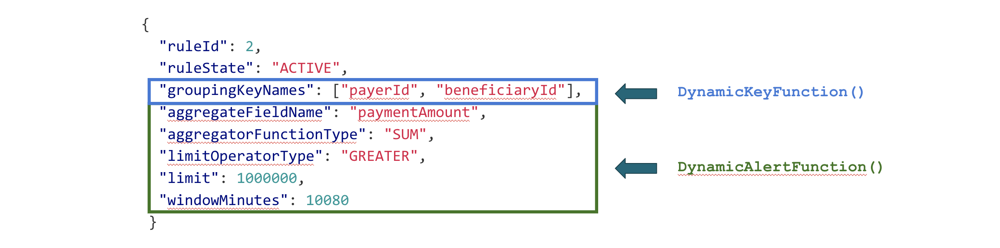

In the [first article](https://flink.apache.org/news/2020/01/15/demo-fraud-detection.html) of the series, we gave a high-level description of the objectives and required functionality of a Fraud Detection engine. We also described how to make data-partitioning in Apache Flink's customizable based on modifiable rules, instead of using a hardcoded `KeysExtractor` implementation.

We intentionally omitted details of how the applied rules are initialized and what possibilities exist for updating them at runtime. In this post, we will address exactly these details. You will learn how the approach described in Part 1 **[!LINK]** can be applied in combination with a dynamic configuration that makes it possible to avoid recompiling the code with every modification of the business logic execution parameters.


# Rules Broadcasting

Let's first remind ourselves what the data processing pipeline that we created at the previous stage looks like:

```java
DataStream<Alert> alerts =
    transactions
        .process(new DynamicKeyFunction())
        .keyBy((keyed) -> keyed.getKey());
        .process(new DynamicAlertFunction())
```

`DynamicKeyFunction`, as described earlier, provides dynamic data partitioning, while `DynamicAlertFunction` is responsible for executing the main logic of processing transactions and sending alert messages according to defined rules.

For a simplified description, we previously assumed that the applied set of rules are pre-initialized and are accessible via the `List<Rules>` within DynamicKeyFunction.

```java
public class DynamicKeyFunction
    extends ProcessFunction<Transaction, Keyed<Transaction, String, Integer>> {

  /* Simplified */
  List<Rule> rules = /* Rules that are initialized somehow.*/;
  ...
}
```

Obviously, adding rules to this list is possible directly inside the code of the Flink Job at the stage of its initialization (create a List object, use it's `add` method). A major drawback of doing so is that it will require recompilation of the job with each rule modification. In the real Fraud Detection system, you can expect to modify these rules on a frequent basis, which makes this approach unacceptable from the point of view of business and operational requirements - a different approach is needed.

Let's next have a look at the example of DSL of one of the sample rules presented in the previous post:

<center>

<br/>
<i><small>Figure 1: Rules DSL</small></i>
</center>
<br/>



Earlier we have already seen how part of this definition, namely `groupingKeyNames`, is used in `DynamicKeyFunction` to extract message keys. At the same time, all other parameters of this rule are necessary within `DynamicAlertFunction` - they define the actual logic of performed operations and it's parameters (such as the alert triggering limit). This means that the same rule must be present in both `DynamicKeyFunction` and `DynamicAlertFunction`. To achieve this result, we will use a special data distribution mechanism in Apache Flink - [events broadcast](https://ci.apache.org/projects/flink/flink-docs-stable/dev/stream/state/broadcast_state.html). Let’s turn to the Job Graph of the system that we are building:

<center>

<br/>
<i><small>Figure 2: Job Graph</small></i>
</center>
<br/>


On it you can see the main blocks of our Transactions processing pipeline:<br>

* **Transaction Source**, consuming transaction messages from Kafka partitions in parallel <br>
    * The forward operator following it means that all data consumed by one of the parallel instances of Transaction Source operator will be transferred to exactly one instance of the subsequent DynamicKeyFunction operator, without redistribution. It also indicates the same level of parallelism of two connected operators (12 in this case).

 <center>
 
 <br/>
 <i><small>Figure 3: Message passing across operators : FORWARD</small></i>
 </center>
 <br/>


* **Dynamic Key Function**, which performs data enrichment with a dynamic key. The subsequent `keyBy` operator performs `hashing` of this dynamic key and corresponding data sharding
    * hash here means that for each message a hash code is calculated and messages are evenly distributed among available parallel instances of the following operator.

 <center>
 
 <br/>
 <i><small>Figure 4: Message passing across operators : HASH (keyBy)</small></i>
 </center>
 <br/>


* **DynamicAlertFunction** that accumulates a data window and creates Alerts based on it
    * Rebalance means that the data redistribution is caused not by the explicit `keyBy` operator, but by a change in parallelism (12 -> 1).

<center>
 
 <br/>
 <i><small>Figure 5: Message passing across operators : REBALANCE</small></i>
 </center>
 <br/>


At the top of the Job Graph you can see an additional data source - **Rules Source**, which also consumes from Kafka. Rules are "mixed-in" into the main processing data flow through the `broadcast` operation. Unlike other methods of transmitting data between operators, such as `forward` and `hash`, which make each message available for processing in only one of the parallel instances of the receiving operator, broadcast makes each message available at the input of all of the parallel instances of the operator which the broadcast stream is connected to. This makes broadcast applicable to a wide range of tasks that need to affect the processing of all messages, regardless of their key or source partition.

<center>
 
 <br/>
 <i><small>Figure 6: Message passing across operators : BROADCAST</small></i>
 </center>
 <br/>


In order to make use of that additional data source, we first need to "connect" it to the main data stream at the stage of Job Graph definition as follows:

//The connection of the reference flow to the Transactions flow is made as follows:

```java
// Streams setup
DataStream<Transaction> transactions = [...]
DataStream<Rule> rulesUpdateStream = [...]

BroadcastStream<Rule> rulesStream = rulesUpdateStream.broadcast(RULES_STATE_DESCRIPTOR);

// Processing pipeline setup
 DataStream<Alert> alerts =
     transactions
         .connect(rulesStream)
         .process(new DynamicKeyFunction())
          .keyBy((keyed) -> keyed.getKey())
         .connect(rulesStream)
         .process(new DynamicAlertFunction())
```

As you can see, the broadcast stream can be created from any regular stream by  calling the `broadcast` method and specifying a state descriptor. It is assumed that broadcasted data in the majority of cases needs to be stored and retrieved while processing events of the main data flow, therefore there there is always a corresponding broadcast state created. Unlike other Apache Flink state types, broadcast state is automatically made available in the subsequent processing function, without the need to initialize it in the `open()` method. The broadcast state always has a key-value format (MapState).

```java
public static final MapStateDescriptor<Integer, Rule> RULES_STATE_DESCRIPTOR =
        new MapStateDescriptor<>(
            "keys", BasicTypeInfo.INT_TYPE_INFO, TypeInformation.of(Rule.class));
```

Connecting to `rulesStream` causes some changes in the signature of the processing functions. Presented in a slightly simplified way in the previous article as `ProcessFunction`, `DynamicKeyFunction` is in reality `BroadcastProcessFunction`.

```java
public abstract class BroadcastProcessFunction<IN1, IN2, OUT> {

    public abstract void processElement(IN1 value, ReadOnlyContext ctx, Collector<OUT> out) throws Exception;

    public abstract void processBroadcastElement(IN2 value, Context ctx, Collector<OUT> out) throws Exception;

}
```

The difference is the addition of a `processBroadcastElement` method through which the control messages will arrive. The version of `DynamicKeyFunciton` that allows  modifying the list of data distribution keys at runtime by sending rules definitions to `rules` Kafka topic (`RulesSource`) looks as follows:

```java
public class DynamicKeyFunction
    extends BroadcastProcessFunction<Transaction, Rule, Keyed<Transaction, String, Integer>> {


  @Override
  public void processBroadcastElement(Rule rule,
                                     Context ctx,
                                     Collector<Keyed<Transaction, String, Integer>> out) {
    BroadcastState<Integer, Rule> broadcastState = ctx.getBroadcastState(RULES_STATE_DESCRIPTOR);
    broadcastState.put(rule.getRuleId(), rule);
  }

  @Override
  public void processElement(Transaction event,
                           ReadOnlyContext ctx,
                           Collector<Keyed<Transaction, String, Integer>> out){
    ReadOnlyBroadcastState<Integer, Rule> rulesState =
                                  ctx.getBroadcastState(RULES_STATE_DESCRIPTOR);
    for (Map.Entry<Integer, Rule> entry : rulesState.immutableEntries()) {
        final Rule rule = entry.getValue();
        out.collect(
          new Keyed<>(
            event, KeysExtractor.getKey(rule.getGroupingKeyNames(), event), rule.getRuleId()));
    }
  }
}
```

In the above code `processElement()` receives Transactions and `processBroadcastElement()` receives Rules updates. When a new rule is created, it is distributed and saved in all parallel instances of the operator using `processBroadcastState`, as depicted in Figure 6. We use Rule's ID as the key to store and reference individual rules. Instead of iterating over a hardcoded `List<Rules>`, iteration is performed over entries in the dynamically updated broadcast state.

`DynamicAlertFunction` follows the same logic with respect to storing the rules in the broadcast MapState. As described in Part 1  **[!LINK]**, each message in the `processElement` input is intended to be processed by one specific rule and comes "pre-marked" with a corresponding ID by  `DynamicKeyFunction`. All we need to do is retrieve the definition of the corresponding rule from `BroadcastState` by the provided ID and process it according to the logic required by that rule. At this stage, we will also add messages to the internal function state in order to perform calculations on the required time window of data. We will consider how it is done in the final blog of the series about Fraud Detection.

# Summary
In this blogpost, we have continued our investigation of the use case of the Fraud Detection System built with Apache Flink. We have looked into different ways in which data can be distributed between Flink operators, and specifically into details of events broadcast. We have demonstrated, how `DynamicDataPartitioning` pattern described in the first part of the series **[LINK]** can be combined and enhanced by the functionality provided by the broadcast state pattern. The ability to send dynamic updates at runtime is a powerful feature of Apache Flink, which is applicable in a variety of other use cases, such as:
* Control of state (cleanup/insert/fix)
* A/B experiments
* Updates of ML model coefficients
